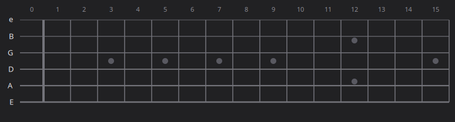
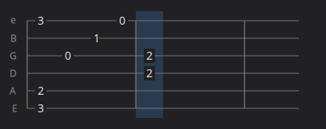

# BBTab

A click-to-write guitar **tablature editor** for GTK4 / GNOME (libadwaita).

Write tabs the way you think about them: **click a fret on the fretboard** and
the note drops onto the staff below. Build a chord by clicking several frets,
add bends, slides, vibrato and holds to the selected note, then move on to the
next beat.

The fretboard (click a fret to add a note):



...drops onto the tab staff (cursor column highlighted):



## Features (v0.1)

- **Interactive fretboard** — open strings plus 15 frets, standard tuning,
  inlay dots (single at 3/5/7/9/15, double at 12), hover highlight.
- **Live tab staff** — movable cursor, bar lines every measure, string labels;
  click any column/row to jump the cursor and select a note.
- **Click-to-place** notes, chords, and rests (an empty beat is a rest).
  An **Auto-advance** toggle jumps to the next beat after each note — turn it
  off to stack a chord in one beat.
- **Per-note techniques** on the selected note:
  - **Bends** — ¼, ½, full, 1½, 2 tones (rendered as `b`, `b½`, …).
  - **Hold / duration** — sustain or bend a note across up to 16 beats, drawn
    as a line to the right; other strings stay playable underneath.
  - **Vibrato** — trailing `v`.
  - **Slides** — slide *to* a note (`/9`) and slide *from* a note (`7/`), with
    the slash direction inferred from the neighbouring fret.
- **Keyboard flow** (see below).
- **Save / open** as plain-JSON, versioned `.bbtab` files
  (`Ctrl+S` / `Ctrl+O` / `Ctrl+N`).
- **Light / dark aware**, with a Follow-system / Light / Dark switcher.

### Keyboard

| Key | Action |
|-----|--------|
| `Space` | Next beat (adds one at the end) |
| `→` / `←` | Move cursor right / left |
| `↑` / `↓` | Select a higher / lower string |
| `b` | Cycle the bend amount on the selected note |
| `v` | Toggle vibrato |
| `/` | Toggle slide **from** this note |
| `\` | Toggle slide **to** this note |
| `Delete` | Delete just the selected note |
| `Shift`+`Delete` | Clear the whole beat |
| `Backspace` | Clear the beat; if already empty, delete it and step back |
| `Ctrl`+`S` / `Ctrl`+`O` / `Ctrl`+`N` | Save / Open / New |

## Requirements

System packages (Ubuntu/Debian — already the standard GNOME stack):

```sh
sudo apt install python3-gi python3-gi-cairo gir1.2-gtk-4.0 gir1.2-adw-1
```

No `pip` packages are needed.

## Run

```sh
python3 run.py                # or: python3 -m bbtab
python3 run.py mysong.bbtab   # open a file
```

A `.venv` (created with `--system-site-packages`) is included for convenience:

```sh
.venv/bin/python run.py
```

## How it's built

The app is two custom-drawn Cairo canvases sharing one data model; GTK/Adwaita
is just the frame around them. The model imports no GTK and serialises to plain,
versioned JSON, so the format stays readable and forward-compatible.

| File | Role |
|------|------|
| `bbtab/model.py`     | `Song → Beat → Note` (bend/hold/vibrato/slides), JSON load/save |
| `bbtab/fretboard.py` | clickable fretboard `DrawingArea` |
| `bbtab/tabview.py`   | tab staff `DrawingArea` + cursor, technique rendering |
| `bbtab/window.py`    | header bar, editing loop, technique controls, file dialogs, keyboard |
| `bbtab/app.py`       | `Adw.Application` entry point |
| `bbtab/theme.py`     | light/dark palette for the canvases |

## Roadmap (ideas for next)

- Unsaved-changes prompt on New / Open / quit.
- Note durations (whole/half/quarter/eighth) and proper beat spacing.
- More techniques: hammer-on/pull-off, palm mute.
- Playback (MIDI via `fluidsynth`) and export (ASCII tab / MusicXML / Guitar Pro).
- Number-key note entry, copy/paste, undo/redo.
- Custom tunings & capo, multiple tracks.
- Flatpak packaging (Meson).

## License & contributing

BBTab is my product, and it's open source. You have two ways to take part:

- **Fork it and go your own way.** You're free to fork the repository and
  continue the project however you like, as your own independent project, with
  no obligation to me — see [`LICENSE`](LICENSE).
- **Suggest, and I build it.** Send bug reports, feature requests, or patches,
  and I'll adopt, adapt, or defer them according to my own roadmap.

See [`LICENSE`](LICENSE) for the full terms.
